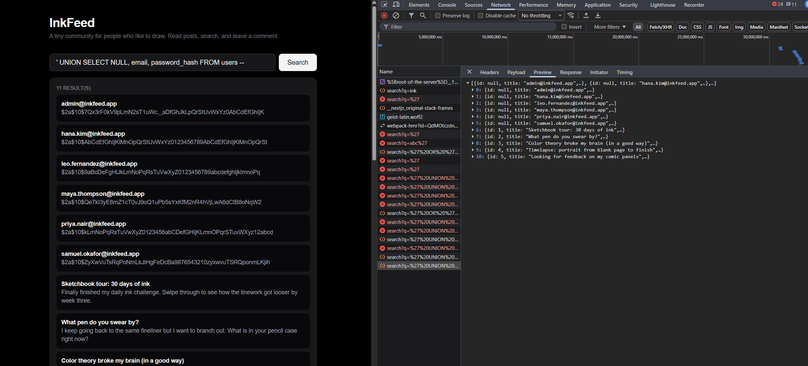

# NOTES.md — The Breach Report

This file is part of the deliverable. We grade the **thinking**, not the length.
Fill it in as you work, not at the very end. If you can explain what you did and
why, you have passed, even if your sentences are short.

---

## 1. First impressions

Before attacking anything, write down what the app does and where untrusted input
reaches the backend. Which inputs does a stranger control?

_Your notes:_
InkFeed is a social media-style feed application. Users can search through posts using a search box. The search functionality sends the query to the backend through the q parameter: /api/posts/search. This input reaches the database directly and is most likely used inside a WHERE ... LIKE '%input%' clause. A stranger, meaning any user, can fully control the search input.

---

## 2. Reproducing the breach

### What I've typed to test the vulnerability and where

I first confirmed the vulnerability with:
- `' OR '1'='1` → Returned **200 OK**, meaning SQL injection is possible.

Then I needed to find the correct number of columns for UNION attack. I tested progressively:

1. `' UNION SELECT NULL --`  
2. `' UNION SELECT NULL,NULL --`  
3. `' UNION SELECT NULL,NULL,NULL --` ← **This returned 200 OK**  
4. `' UNION SELECT NULL,NULL,NULL,NULL --`  
5. `' UNION SELECT NULL,NULL,NULL,NULL,NULL --`

From these tests I determined that the original query returns **3 columns**. After that I used the final payload.

### What each part of it does

Break your payload into pieces and explain each one. For example: what closes the
original string, what pulls in the other table, what hides the rest of the query.

* `'` → Closes the original string inside the `LIKE '%...%'` clause early. This breaks out of the normal search value and allows the input to become part of the SQL query.

* `UNION SELECT` → Adds the results of a second query to the original search query. This is the SQL feature that allows rows from another query to be combined with the original result set, as long as the number of columns matches.

* `NULL, email, password_hash` → Matches the three columns expected by the original result structure: `id`, `title`, and `body`. `NULL` is used for the hidden `id`, while `email` appears where the frontend normally shows the title, and `password_hash` appears where the frontend normally shows the body.

* `FROM users` → Tells the database to read data from the private `users` table instead of only returning data from the public `posts` table.

* `--` → Comments out the rest of the original SQL query after the injected part, so the leftover SQL does not cause a syntax error.


### What came back

What data appeared that should never have been there? Paste
a line or two. A screenshot is ideal.

SQL Injection Screenshot:


---

## 3. Why it worked (root cause)

In your own words: why was the database willing to run that instead of the expected behaviour?

The database executed my injected query because the application took the raw user input from the search box and inserted it directly into the SQL query without any escaping or prepared statements. 

This allowed me to break out of the string with `'`, append my own query using `UNION SELECT`, match the column count, and comment out the remaining SQL with `--`. The app did not validate or sanitize the input, so the database returned whatever I asked for.

---

## 4. The fix

### Which road did I take?

(parameterized native query / the safe repository method / something else)

```java
String sql = "SELECT id, title, body FROM posts " +
             "WHERE title LIKE CONCAT('%', :q, '%') " +
             "OR body LIKE CONCAT('%', :q, '%')";

List<Object[]> rows = entityManager.createNativeQuery(sql)
        .setParameter("q", q)
        .getResultList();
```

### Why this fixes the root cause and not just the symptom

"The error went away" is not an answer. Explain why injection is now impossible,
not just unlikely.

This fix solves the root cause because the user input (q) is no longer concatenated directly into the SQL string. Instead, it is sent to the database as a separate parameter.
The database driver handles escaping special characters (like ' , UNION, -- etc.) automatically. Even if the attacker sends malicious SQL, it is treated as data (a search term), not as executable code. Therefore, classic injection techniques like breaking out of the string or using UNION no longer work.

### Why I did NOT just block quotes / the word UNION

Blocking specific words (like UNION, --, or ') is a bad approach because:

- Attackers can easily bypass it (e.g. UniOn, /**/UNION/**/, different encodings).
- It doesn't fix the fundamental problem (lack of proper input handling).
- It can break legitimate searches that contain those words.
- Proper parameterization is the industry-standard and most secure solution.

---

## 5. Proof the fix holds

I re-ran my original payload after fixing it. Result:

Original attack payload:
' UNION SELECT NULL, email, password_hash FROM users --

- Result: No results returned (or only legitimate posts if any matched). The injection was successfully blocked. Admin email and password hash no longer appear.

A normal search (`pen`, `color`, `comic`) still returns the right posts:

Yes, normal searches continue to work correctly. I tested several normal words and got the expected posts without any issues.

---

## 6. If I had another hour

What else in this app worries you? (the comment endpoint, the open API, the fact
that the backend can read password hashes at all...)

_Your notes:_
