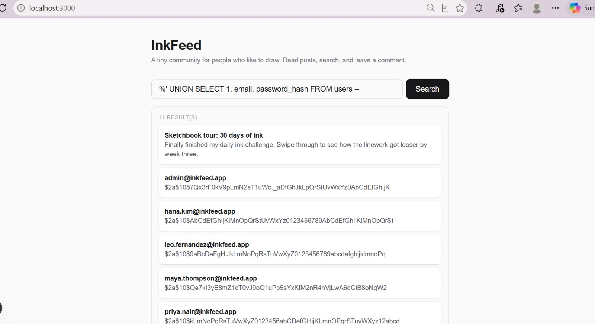

# NOTES.md — The Breach Report

This file is part of the deliverable. We grade the **thinking**, not the length.
Fill it in as you work, not at the very end. If you can explain what you did and
why, you have passed, even if your sentences are short.

---

## 1. First impressions

Before attacking anything, write down what the app does and where untrusted input
reaches the backend. Which inputs does a stranger control?

_Your notes:_
The app is a small feed named InkFeed where users can read posts, search for posts, and leave comments. A stranger controls the search input box on the frontend, which sends a request directly to the backend search API endpoint. This untrusted input reaches the database directly through the search query.

---

## 2. Reproducing the breach

### What I've typed to test the vulnerability and where

```
(%' UNION SELECT 1, email, password_hash FROM users --)
```

### What each part of it does

Break your payload into pieces and explain each one. For example: what closes the
original string, what pulls in the other table, what hides the rest of the query.

_Your notes:_

%' - Closes the original string literal inside the proqrammer's LIKE clause early, allowing us to break out of the intended query logic.

UNION SELECT 1, email, password_hash FROM users - Combines the result set of the original posts query with rows from the sensitive users table. We selected exactly 3 columns (1, email, password_hash) to match the column count (id, title, body) of the original query.

-- - Comments out the remainder of the developer's original SQL query so that the trailing syntax is completely ignored by the database, preventing syntax errors.

### What came back

What data appeared that should never have been there? Paste
a line or two. A screenshot is ideal.

_Your notes:_

The search box successfully returned the contents of the users table directly inside the UI cards. It leaked the admin's email and their secure BCrypt password hash:

admin@inkfeed.app

$2a$10$7Qx3rF0kV9pLmN2sT1uWc._aDfGhJkLpQrStUvWxYz0AbCdEfGhIjK




---

## 3. Why it worked (root cause)

In your own words: why was the database willing to run that instead of the expected behaviour?

_Your notes:_

It worked because the backend application dynamically constructs the SQL statement by using direct String concatenation (e.g., + keyword +). The database cannot distinguish between the developer's structural code and the user's untrusted data. It treated the malicious input as legal SQL instructions rather than a simple literal string to look up.

---

### 4. The fix

### Which road did I take?
I used a parameterized native query with named parameters (`:keyword`) via the `EntityManager`.

### Why this fixes the root cause and not just the symptom
Instead of concatenating the raw user input directly into the SQL string, the parameter mechanism forces the database to compile the SQL query template first. The user input is treated strictly as a literal text value binded to `:keyword`. Even if the input contains single quotes or SQL commands, they are safely escaped and processed as search text, making SQL injection mathematically impossible.
### Why this fixes the root cause and not just the symptom

"The error went away" is not an answer. Explain why injection is now impossible,
not just unlikely.

_Your notes:_

By switching to parameterized queries, the database compiles the SQL query structure before inserting our input. The user's input is treated strictly as a literal parameter value (a string), meaning any quotes or SQL keywords like UNION inside the input will safely be treated as plain text rather than executable database commands.

### Why I did NOT just block quotes / the word UNION

_Your notes:_
Blacklisting words like UNION or blocking single quotes is a poor security practice. Attackers can easily bypass simple filters using alternative encodings, uppercase/lowercase variations, or alternative SQL syntax. Furthermore, legitimate users might need to search for words that contain quotes (like "O'Connor" or "don't"), and blocking them breaks normal application functionality.

---

## 5. Proof the fix holds

I re-ran my original payload after fixing it. Result:

_Your notes:_
The application safely handled the input and returned 0 results. No errors occurred in the backend, and absolutely no user data leaked.

A normal search (`pen`, `color`, `comic`) still returns the right posts:

_(Yes, normal search works flawlessly and returns the actual matching posts from the database without any issues.)_

---

## 6. If I had another hour

What else in this app worries you? (the comment endpoint, the open API, the fact
that the backend can read password hashes at all...)

_Your notes:_
I am worried about the comment submission endpoint; if the search input was vulnerable to concatenation, the comment box might be vulnerable to SQL Injection or Cross-Site Scripting (XSS) as well. Additionally, the backend logs show a cleartext generated security password on startup, and sensitive API routes lack proper role-based authorization guards.
