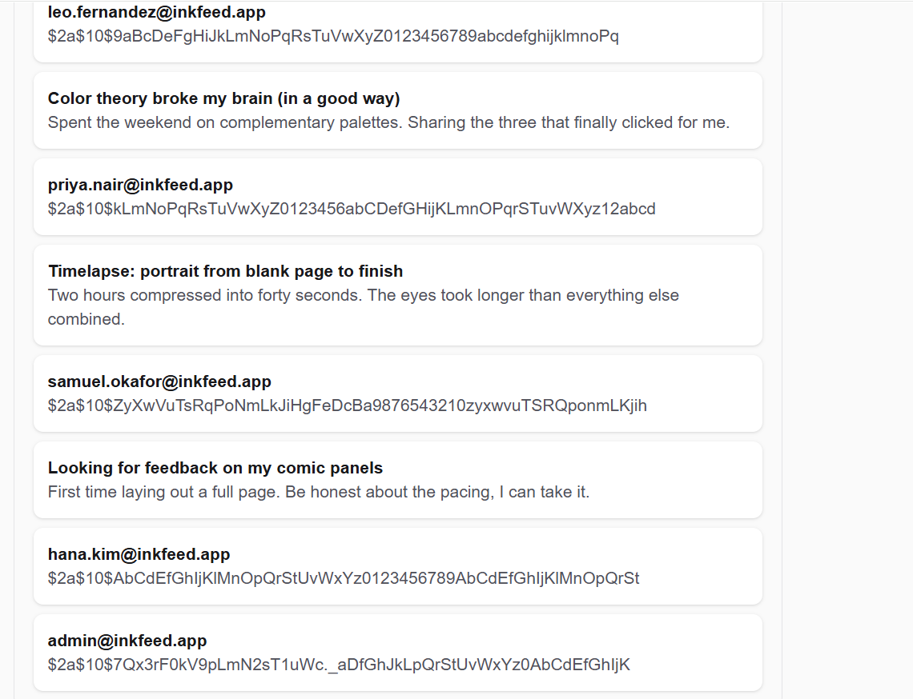

# NOTES.md — The Breach Report

---

## 1. First impressions

_Your notes:_

This app has a feed with posts (title + body) and a search box that searches 
both. Anyone using the app controls the `q` parameter in the search request — 
that's the input I focused on, because the backend was building raw SQL 
from it directly. The comment box also takes raw input from anyone, but it 
doesn't use raw SQL, so it's a different story.

---

## 2. Reproducing the breach

### What I've typed to test the vulnerability and where

```
Tested in the search box on the feed page.
' UNION SELECT id, email, password_hash FROM users--
```

### What each part of it does

_Your notes:_

- `'` closes the string that the backend opens with `LIKE '%`, so my text 
  stops being a search word and turns into the start of my own SQL.
- `UNION SELECT id, email, password_hash FROM users` adds rows from the 
  users table on top of the posts results. Column count (3) and order match 
  the original query (id, title, body), so the database accepts it. That's 
  why email shows up where title should be, and password_hash shows up 
  where body should be.
- `--` comments out everything left on that line, so the leftover part of 
  the original query doesn't cause a syntax error.


### What came back

_Your notes:_

All users, including admin@inkfeed.app, showed up in the search results 
looking like normal posts — email instead of title, password hash instead 
of body.


---

## 3. Why it worked (root cause)

_Your notes:_

The search endpoint built the SQL by gluing my input straight into the 
string with `+`:

```java
String sql = "SELECT id, title, body FROM posts " +
        "WHERE title LIKE '%" + q + "%' OR body LIKE '%" + q + "%'";
```

The database couldn't tell my input apart from real SQL. Whatever I typed 
became part of the query itself, not just something to search for.


---

## 4. The fix

### Which road did I take?

_Your notes:_

Used the safe repository method that was already in PostRepository.java 
but not being used:

```java
findByTitleContainingIgnoreCaseOrBodyContainingIgnoreCase(q, q)
``` 

### Why this fixes the root cause and not just the symptom

_Your notes:_

Spring Data builds this query and sends `q` as a real parameter, not as 
text glued into the SQL. The database gets the query and the value 
separately, so the value can never change the query. My input is always 
just data to search for, never SQL commands, no matter what I type.

### Why I did NOT just block quotes / the word UNION

_Your notes:_

Blocking characters or keywords doesn't really work — there's always 
another way around it. It also breaks normal use, like someone named 
O'Brien searching for their posts. The real fix is to stop building SQL 
by gluing strings together, so input can't change the query no matter what.


---

## 5. Proof the fix holds

_Your notes:_

Result: 0 results, no errors, nothing leaked.
Normal search (pen, color, comic) still works:

Yes — searching "pen" returned the pen post and the color theory post 
(mentions "pencil"). No errors in browser console or backend terminal.

---

## 6. If I had another hour

_Your notes:_

- Comment endpoint takes raw input from anyone, no login. Tested it with 
  ' OR '1'='1 and it just saved as plain text, no injection — because it 
  uses commentRepository.save(), not raw SQL. Still no length/spam check though.
- Even after the fix, the backend's database user can still read the users 
  table. If another bug shows up later, that access shouldn't be there at 
  all — the search API should only be able to read posts.
- The fact that password hashes were even reachable from a posts search 
  endpoint shows the backend has more database access than it actually needs.
- No length limit on the search input. Not a security issue anymore because 
  of the parameterized query, but a basic check would be a reasonable extra 
  layer on top.
